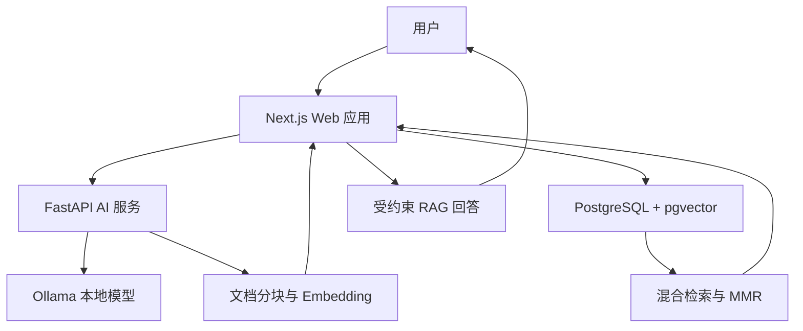

# KnowFlow

KnowFlow 是一个本地化 AI 知识库与 RAG 智能问答系统，覆盖知识管理、文档分块、向量索引、混合检索、MMR 去冗余、受约束生成、来源追踪、运行监控和离线评测等完整链路。

项目采用 Next.js 与 FastAPI 分层架构，使用 PostgreSQL + pgvector 保存文本分块及 768 维向量，并通过 Ollama 在本地运行多语言 Embedding 模型和 Qwen 大语言模型。

## 核心能力

- 知识新增、编辑、删除、详情展示、搜索和标签过滤
- TXT/Markdown 文档导入与可配置重叠分块
- FastAPI 独立封装 Embedding、文档预处理和模型分析能力
- `nomic-embed-text-v2-moe` 多语言向量化
- `search_query:` 与 `search_document:` 任务前缀
- PostgreSQL + pgvector 余弦距离 Top-K 召回
- 语义相似度与关键词重叠率混合排序
- MMR 最大边际相关性去冗余
- 知识记录与向量 Chunk 事务一致性写入
- Embedding 服务异常时关键词检索降级
- Qwen 本地 RAG 问答与片段级来源追踪
- AI 摘要及标签生成
- RAG 查询日志、系统状态与 Dashboard
- 冷启动、模型加载、Prompt 处理及生成速度监控
- 固定评测语料一键初始化
- Hit@K、MRR、拒绝准确率及 P95 延迟自动评测

## 系统架构



### 组件职责

| 组件 | 职责 |
|---|---|
| Next.js | 页面交互、Server Actions、业务编排、检索和 RAG 上下文构建 |
| FastAPI | 文档预处理、批量 Embedding、AI 摘要与标签分析 |
| PostgreSQL | 知识记录、用户数据和 RAG 查询日志 |
| pgvector | 768 维向量存储、余弦距离计算和 Top-K 召回 |
| Ollama | 本地运行 Qwen 与多语言 Embedding 模型 |
| Prisma ORM | 数据模型、事务写入、迁移和类型安全查询 |

## 文档索引流程

1. 用户创建、更新或导入知识。
2. Next.js 将标题和正文发送给 FastAPI。
3. FastAPI 对文本标准化并进行重叠分块。
4. 文档分块增加 `search_document:` 任务前缀。
5. `nomic-embed-text-v2-moe` 批量生成 768 维向量。
6. PostgreSQL 事务同时写入知识记录与 pgvector Chunk。
7. 任意数据库操作失败时整体回滚，避免正文与索引不一致。

每个 Chunk 保存：

- 所属知识 ID
- Chunk 序号
- 文本内容
- 起止偏移量
- Embedding 模型名称
- 768 维 pgvector 向量

## RAG 检索与问答流程

1. 用户问题增加 `search_query:` 任务前缀并生成查询向量。
2. pgvector 使用余弦距离召回 Top-30 文本分块。
3. 同一知识的多个 Chunk 按最大相似度聚合。
4. 使用语义分数和关键词分数进行混合排序：

```text
score = 0.85 × semantic_score + 0.15 × lexical_score
```

5. 使用最低相关度阈值过滤候选。
6. 使用 MMR 抑制候选知识之间的内容冗余：

```text
MMR(d) =
λ × relevance(d, query)
- (1 - λ) × max_similarity(d, selected)
```

7. 将 Top-K 片段构造成受约束 Context。
8. Qwen 只能依据检索内容回答；知识不足时返回无法确定。
9. 返回答案、知识标题、相关度、Chunk 序号和原文片段。
10. 记录问题、召回数量、Top Score、来源 ID 和回答。

## 数据一致性设计

知识与向量索引使用同一个 PostgreSQL 事务维护：

- 创建知识：写入 Post 后写入全部 KnowledgeChunk
- 更新知识：更新 Post、删除旧 Chunk、写入新 Chunk
- 删除知识：通过外键级联删除关联 Chunk
- 重建索引：每篇知识使用独立事务更新
- 写入失败：事务整体回滚

该设计避免了业务数据已更新但向量索引仍为旧版本的问题。

## 服务降级

正常情况下，知识搜索使用 pgvector 语义召回与关键词混合评分。

当 FastAPI 或 Embedding 模型不可用时，知识搜索自动降级为关键词匹配，使基础搜索页面仍然可用，并在日志中标记：

```text
search mode: lexical-fallback
```

## 检索评测

项目提供固定评测语料和实时检索评测脚本：

```bash
npm run seed:evaluation
npm run evaluate -- evaluation/rag-retrieval.json evaluation/results-final.json
```

评测流程会真实调用：

```text
FastAPI Embedding
→ pgvector 召回
→ 多 Chunk 聚合
→ 混合评分
→ 阈值过滤
→ MMR 排序
```

### 最终结果

固定评测集包含 8 篇领域知识、20 条正样本问题和 4 条知识库外问题。

| 指标 | 结果 |
|---|---:|
| Corpus Documents | 8 |
| Questions | 24 |
| Hit@1 | 95.0% |
| Hit@3 | 100.0% |
| Hit@5 | 100.0% |
| MRR | 0.9750 |
| Reject Accuracy | 100.0% |
| Average Total Latency | 771.73 ms |
| P95 Total Latency | 758.52 ms |
| Average Embedding Latency | 703.71 ms |
| Average pgvector Latency | 50.21 ms |
| P95 pgvector Latency | 52.92 ms |

第一次查询包含约 2.65 秒模型冷启动；后续热启动查询通常稳定在约 650～750 毫秒。

测试环境：

- Intel Core i5-1035G1
- 8GB RAM
- 无 CUDA 推理环境
- Windows
- PostgreSQL 17 + pgvector 0.8.6

详细评测方法、指标定义及局限性见 [evaluation/README.md](evaluation/README.md)。

## RAG 生成性能

项目记录 Ollama 原生推理指标：

- 模型加载耗时
- Prompt Token 数
- Prompt 处理耗时
- 输出 Token 数
- 生成耗时
- Tokens/s
- 完成原因

通过 `keep_alive`、上下文窗口和生成长度优化，本地 CPU 环境下：

| 场景 | 端到端耗时 |
|---|---:|
| 冷启动 | 约 61.2 秒 |
| 热启动 | 约 9.3 秒 |
| pgvector 召回 | 约 40～60 毫秒 |

热启动相较冷启动降低约 85%，剩余耗时主要来自 CPU 上的本地大模型逐 Token 推理。

## 技术栈

### Web

- Next.js 16
- React 19
- TypeScript 5
- Tailwind CSS 4
- React Server Components
- Server Actions

### AI Service

- Python 3.11
- FastAPI
- Pydantic
- HTTPX
- Uvicorn
- Ruff
- Pytest

### Data and AI

- PostgreSQL 17
- pgvector 0.8.6
- Prisma Next ORM
- Ollama
- Qwen3 1.7B
- nomic-embed-text-v2-moe

### Engineering

- Docker Compose
- ESLint
- TypeScript strict check
- Next.js production build
- 30 项 Python 自动化测试
- 可复现检索评测

## 项目结构

```text
knowflow/
├─ ai-service/
│  ├─ app/
│  │  ├─ core/            # 配置
│  │  ├─ schemas/         # API 请求和响应模型
│  │  ├─ services/        # Ollama、Embedding、分块、分析
│  │  └─ main.py          # FastAPI 入口
│  ├─ tests/              # Python 自动化测试
│  ├─ pyproject.toml
│  └─ requirements.txt
├─ evaluation/
│  ├─ corpus.json         # 固定评测语料
│  ├─ rag-retrieval.json  # 人工标注问题
│  ├─ results-final.json  # 最终评测结果
│  └─ README.md           # 评测说明
├─ migrations/
│  ├─ app/                # 应用数据模型迁移
│  └─ pgvector/           # vector 扩展迁移
├─ scripts/
│  ├─ backfill-knowledge-chunks.mjs
│  ├─ evaluate-retrieval.mjs
│  └─ seed-evaluation-corpus.mjs
├─ src/
│  ├─ app/                # 页面、组件和 Server Actions
│  ├─ lib/                # 检索、分块和 AI 配置
│  └─ prisma/             # Prisma Contract 与数据库运行时
├─ docker-compose.yml
├─ package.json
└─ README.md
```

## 环境要求

- Node.js 20+
- Python 3.11+
- Docker Desktop
- Ollama
- Git

## 本地启动

### 1. 获取项目并安装依赖

```bash
git clone <your-repository-url>
cd knowflow
npm install
```

### 2. 配置环境变量

Windows：

```bat
copy .env.example .env
```

Linux/macOS：

```bash
cp .env.example .env
```

默认数据库配置可直接配合 `docker-compose.yml` 使用。

### 3. 启动 PostgreSQL + pgvector

```bash
docker compose up -d
```

检查状态：

```bash
docker ps --filter "name=knowflow-postgres"
```

### 4. 应用数据库迁移

```bash
npx prisma db migrate
```

### 5. 安装 Ollama 模型

```bash
ollama pull qwen3:1.7b
ollama pull nomic-embed-text-v2-moe
```

检查模型：

```bash
ollama list
```

### 6. 创建 Python 环境

Windows：

```bat
cd ai-service
python -m venv .venv
.venv\Scripts\activate
pip install -r requirements.txt
```

Linux/macOS：

```bash
cd ai-service
python3 -m venv .venv
source .venv/bin/activate
pip install -r requirements.txt
```

### 7. 启动 FastAPI

在 `ai-service` 目录执行：

```bash
python -m uvicorn app.main:app --reload --host 127.0.0.1 --port 8000
```

接口文档：

```text
http://127.0.0.1:8000/docs
```

健康检查：

```text
http://127.0.0.1:8000/api/v1/health
```

### 8. 启动 Next.js

打开另一个终端，在项目根目录执行：

```bash
npm run dev
```

访问：

```text
http://localhost:3000
```

## API

| Method | Endpoint | Description |
|---|---|---|
| GET | `/` | AI 服务信息 |
| GET | `/api/v1/health` | Ollama 与模型健康检查 |
| POST | `/api/v1/embeddings` | Query/Document 批量 Embedding |
| POST | `/api/v1/documents/prepare` | 文档标准化、分块及向量化 |
| POST | `/api/v1/analyze` | AI 摘要和标签分析 |

Embedding 请求示例：

```json
{
  "texts": [
    "KnowFlow如何实现文档检索？"
  ],
  "input_type": "query"
}
```

## 环境变量

| 变量 | 默认值 | 说明 |
|---|---|---|
| `DATABASE_URL` | 本地 PostgreSQL | 数据库连接 |
| `AI_SERVICE_URL` | `http://127.0.0.1:8000` | FastAPI 地址 |
| `OLLAMA_BASE_URL` | `http://127.0.0.1:11434` | Ollama 地址 |
| `OLLAMA_CHAT_MODEL` | `qwen3:1.7b` | 生成模型 |
| `OLLAMA_EMBEDDING_MODEL` | `nomic-embed-text-v2-moe` | 多语言向量模型 |
| `RAG_TOP_K` | `5` | 最终召回数量 |
| `RAG_MIN_SCORE` | `0.35` | 最低相关度 |
| `RAG_MMR_LAMBDA` | `0.70` | MMR 相关性权重 |
| `RAG_CONTEXT_CHARS` | `2000` | 单篇知识上下文字符数 |
| `RAG_CHUNK_SIZE` | `700` | Chunk 目标字符数 |
| `RAG_CHUNK_OVERLAP` | `120` | 相邻 Chunk 重叠字符数 |
| `RAG_MAX_CHUNKS` | `40` | 单篇知识最大 Chunk 数 |
| `OLLAMA_TIMEOUT_MS` | `120000` | Next.js AI 请求超时 |
| `OLLAMA_KEEP_ALIVE` | `10m` | Ollama 模型驻留时间 |

## 质量检查

### Web

```bash
npm run lint
npm run typecheck
npm run build
```

一次性执行：

```bash
npm run verify
```

### AI Service

```bash
cd ai-service
python -m ruff check app tests
python -m pytest -q
```

当前共有 30 项 Python 测试，覆盖：

- 健康检查
- Embedding API
- Query/Document 任务前缀
- 文档分块
- 文档预处理
- AI 分析
- 异常输入和服务失败

## 数据迁移与索引维护

旧知识向量回填：

```bash
npm run backfill:chunks
npm run backfill:chunks -- --apply
```

初始化固定评测语料：

```bash
npm run seed:evaluation
```

已有知识更换 Embedding 模型后，可在“系统状态”页面执行全量索引重建。

## 当前局限

- 评测集规模较小，目前为 24 条人工标注问题
- 生成答案尚未建立自动化 Faithfulness 评测
- 当前使用精确 pgvector 检索，尚未加入 HNSW 索引
- 关键词检索采用轻量词项重叠，而不是标准 BM25
- 本地 CPU 上大模型生成速度受设备性能限制
- 当前定位为个人知识库与工程验证项目，不代表高并发生产系统

## 后续计划

- 增加困难负样本和独立测试集
- 增加回答忠实度及引用正确性评测
- 对比 BM25、纯向量检索和混合检索
- 增加轻量 Reranker
- 增加 HNSW 索引与规模化性能测试
- 增加 GitHub Actions 自动质量检查

## License

本项目用于学习、研究和个人作品展示。